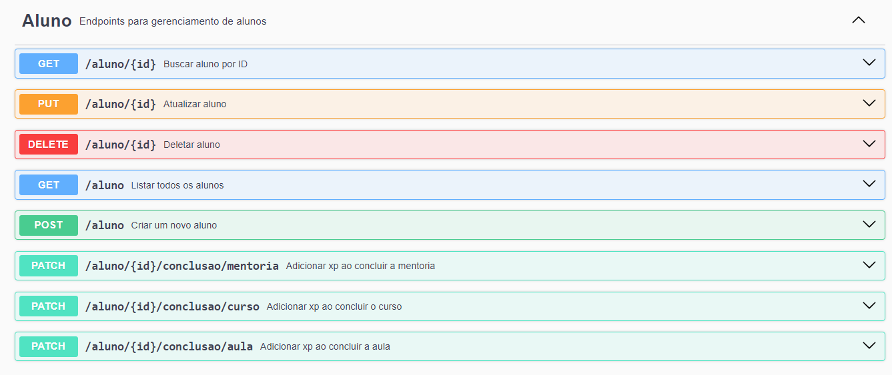
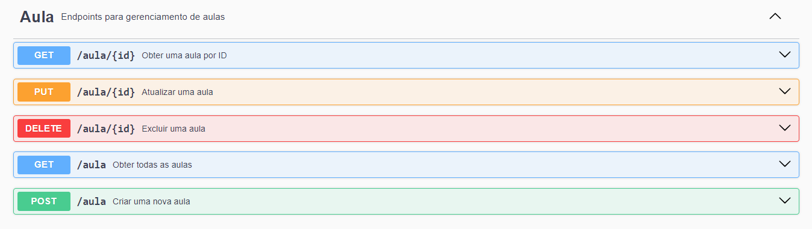
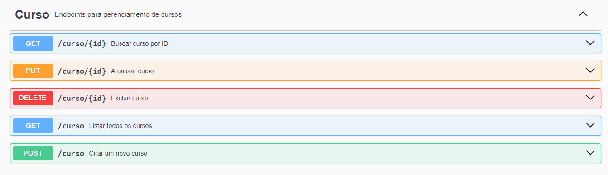
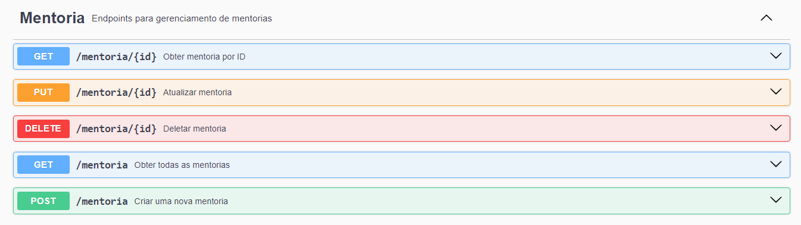
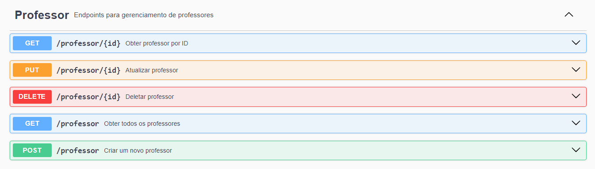

# Abstraindo um Bootcamp com Java

Este é um projeto de API RESTful para gerenciar cursos, mentorias, aulas, alunos e professores. Desenvolvido com Spring Boot, utilizando o banco de dados PostreSQL.

## Funcionalidades

**Aluno**

**Aula**

**Curso**

**Mentoria**

**Professor**

## Configuração do Swagger

Após baixar e executar o projeto, acesse a interface do Swagger UI para explorar a API de forma interativa, acesse:

    http://localhost:8080/swagger-ui/index.html

## Tecnologias Utilizadas

- Java
- Spring Boot
- Spring Data JPA
- PostreSQL
- Swagger UI

## Contribuição

Sinta-se à vontade para abrir issues e pull requests. Todos os tipos de contribuições são bem-vindos!